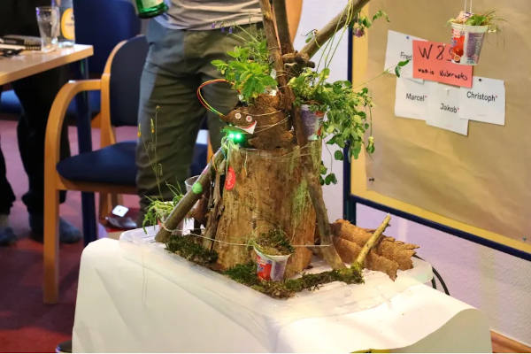
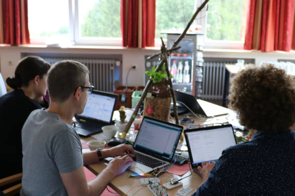

# arduino-woodhack

interactive and LED stripe code for hardware parts of installation made of wood, flotsam, and electronics.
Thanks to [@tilmanjusten](https://github.com/tilmanjusten) for quickling providing a working code base and bringing all of the electronic hardware.
I mostly did the LED animation part (ledstripe.ino).

## reception

"Green Wall-E" won Sevenval Woodhack 2019 hackathon by public vote.

* [Blog article](https://www.sevenval.com/blog/culture/woodhack-2019-projekt-green-wall-e/)

* [Presentation](https://www.slideshare.net/IngoSteinke/green-walle-woodhack-hackathon-2019-winner-project)

